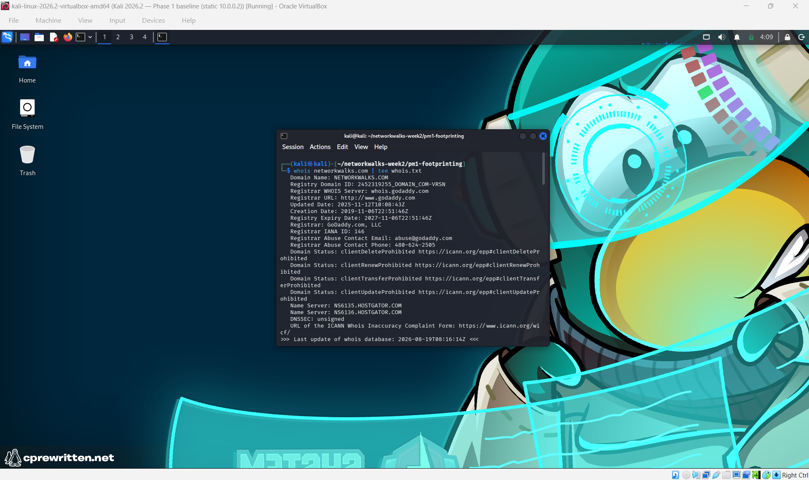
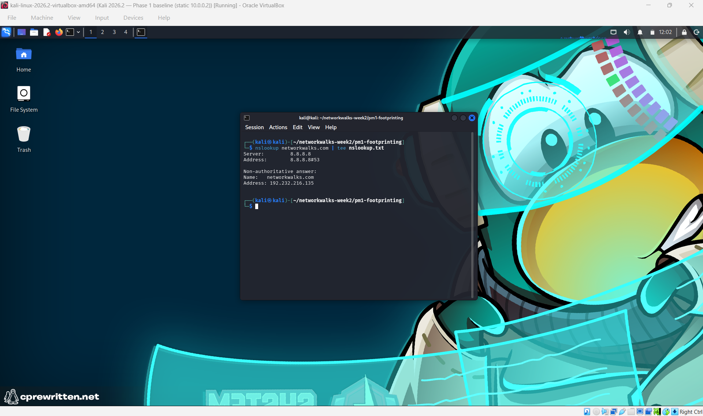
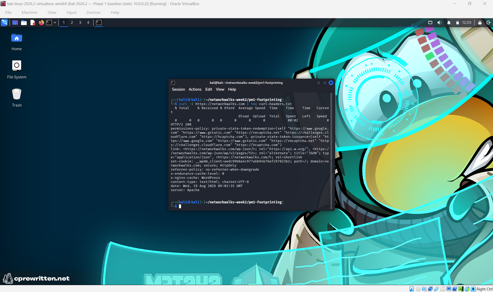
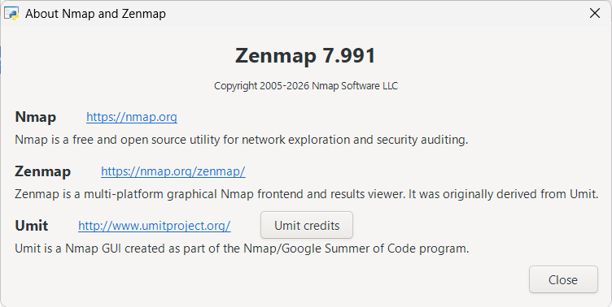
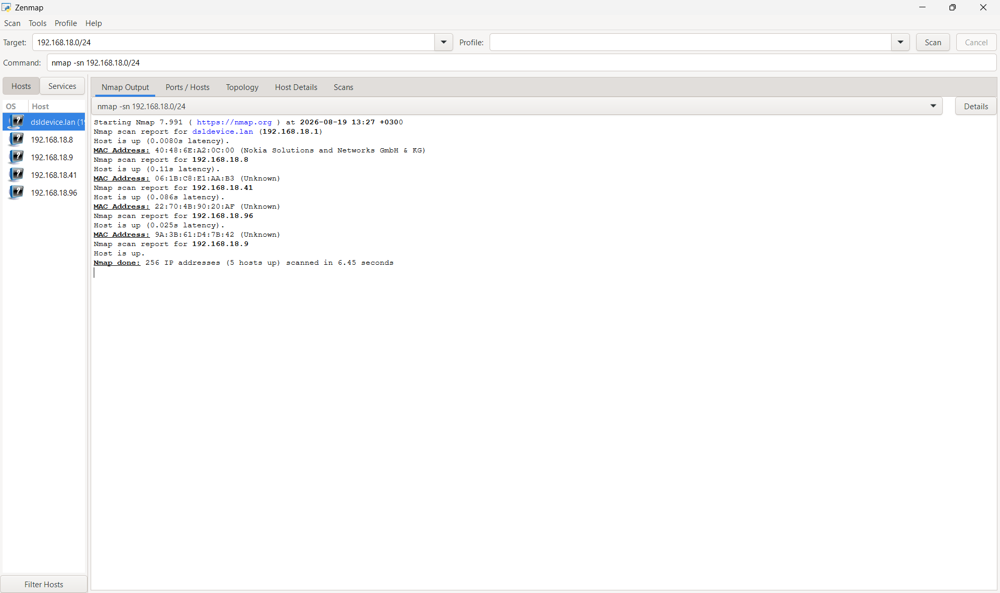
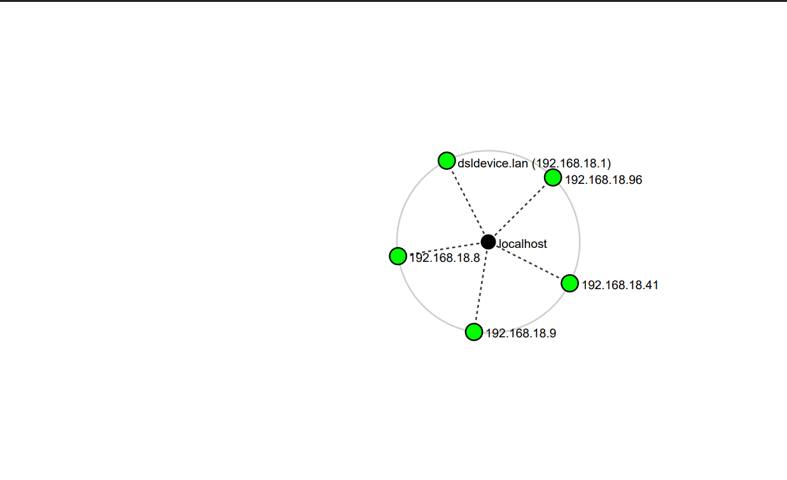

# NetworkWalks B082 — Week 2 · Footprinting & Network Scanning

<p align="center">
  
  
  
  
  
</p>

This repo documents **Week 2** of my Cybersecurity & Ethical Hacking internship with
NetworkWalks Academy (Batch B082). Week 2 has two parts:

- **PM1 — Footprinting & Reconnaissance:** gathering public information about a target
  website (`networkwalks.com`) using six Kali Linux tools.
- **PM5 — Network Scanning with Zenmap:** discovering the live devices on my own home
  network.

Together they cover the first two phases of a penetration test: learning about a
target from the **outside** (footprinting), then mapping a network from the
**inside** (scanning).

---

## ⚠️ Authorization & Scope

All testing here was done under a written **Letter of Authorization** issued for the
NetworkWalks B082 internship.

**In scope:**
- `networkwalks.com` — the client's own website and DNS records (footprinting)
- My own home LAN, which I own and control (scanning)

Nothing else was tested. No exploitation, no attacks — only passive information
gathering and host discovery. The signed authorization is in
[`docs/Letter-of-Authorization.pdf`](docs/Letter-of-Authorization.pdf).

> **Don't repeat any of this against a target you don't own or aren't authorized to
> test.** Scanning without permission can be illegal even if nothing is damaged.

> **Note on addresses:** All IP and MAC addresses shown are from my own private home
> network, a lab environment I own and control. Private (`192.168.x.x`) addresses and
> device MACs are only meaningful inside that local network.

---

## 📋 Overview of Findings

### PM1 — Footprinting `networkwalks.com` *(public information)*

| Item | Finding |
|------|---------|
| **Registrar** | GoDaddy — registered 2019, valid until 2027 |
| **Owner** | Hidden behind a privacy service (Domains By Proxy) |
| **Hosting** | HostGator (`ns6135` / `ns6136.hostgator.com`) |
| **Server IP** | `192.232.216.135` |
| **Web server** | Apache, with an Nginx caching layer |
| **CMS / plugin** | WordPress + WP Download Manager |
| **Exposed endpoint** | WordPress REST API at `/wp-json/` |
| **Firewall** | ModSecurity (SpiderLabs) — the site is protected |
| **DNS software** | BIND 9.16.23 |
| **Mail** | `mail.networkwalks.com`, managed through cPanel |

### PM5 — Scanning my own home network *(host discovery)*

| Item | Finding |
|------|---------|
| **Subnet scanned** | `192.168.18.0/24` |
| **Live hosts found** | 5 (including my own laptop) |
| **Devices** | Nokia router, my MediaTek laptop, and 3 devices with randomized MACs |

> **In short:** starting from just a domain name, PM1 uncovered the target's hosting,
> IP, web stack, mail setup and firewall — all from public information. PM5 then mapped
> a live network and found five devices, some actively hiding their identity through
> MAC randomization.

---

## 🔎 PM1 — Footprinting & Reconnaissance

Six Kali Linux tools were used to build a full public profile of `networkwalks.com`,
without touching the site in a harmful way.

| # | Tool | Purpose |
|:-:|------|---------|
| 1 | `whois` | Find the domain registration details |
| 2 | `whatweb` | Fingerprint the web technologies *(see note)* |
| 3 | `nslookup` | Resolve the domain to its IP address |
| 4 | `curl -I` | Read the HTTP response headers |
| 5 | `wafw00f` | Detect a Web Application Firewall |
| 6 | `dnsrecon` | Enumerate all DNS records |

> **Note on whatweb:** whatweb would not run in either of my environments — it timed
> out on the Kali VM and failed with a library error on my backup Ubuntu machine. This
> left no real gap: the same information (WordPress, the WP Download Manager plugin,
> Apache, the server IP) was already confirmed by the HTTP headers and DNS lookups.
> Only the exact version numbers were missed. This showed me that recon doesn't depend
> on any single tool — the same facts usually leak through more than one.

### Evidence

**`whois` — domain registration** *(GoDaddy registrar, HostGator name servers)*
<p align="center">
  
</p>

**`nslookup` — resolve to IP** *(returns `192.232.216.135`)*
<p align="center">
  
</p>

**`curl -I` — HTTP headers** *(Apache, WordPress, WP Download Manager cookie, `/wp-json/`)*
<p align="center">
  
</p>

**`wafw00f` — firewall detection** *(site is behind ModSecurity)*
<p align="center">
  
</p>

**`dnsrecon` — DNS records** *(name servers, BIND version, MX, SPF, cPanel records)*
<p align="center">
  
</p>

---

## 🖧 PM5 — Network Scanning with Zenmap

The goal was to find the live devices on my own home network, along with their IP and
MAC addresses, and save a network topology.

Zenmap is no longer available on modern Kali Linux (it depends on deprecated Python 2),
so I installed the official Nmap + Zenmap package on **Windows** and scanned my own LAN
from there.

**Scan command:**
```bash
nmap -sn 192.168.18.0/24
```
*(a ping scan — finds live hosts, no port scanning)*

**Result — 5 hosts live:**

| IP | MAC | Device |
|----|-----|--------|
| `192.168.18.1` | `40:48:6E:A2:0C:00` *(Nokia)* | Router / gateway (`dsldevice.lan`) |
| `192.168.18.8` | `06:1B:C8:E1:AA:B3` *(unknown)* | Device with a randomized MAC |
| `192.168.18.9` | `90:E8:68:2B:52:03` *(MediaTek)* | My laptop *(from `ipconfig /all`)* |
| `192.168.18.41` | `22:70:4B:90:20:AF` *(unknown)* | Device with a randomized MAC |
| `192.168.18.96` | `9A:3B:61:D4:7B:42` *(unknown)* | Device with a randomized MAC |

> The scan found the router and my own laptop, plus three devices whose MAC addresses
> are **randomized** — modern phones and laptops do this on purpose to avoid being
> tracked, which is why Nmap couldn't match them to a manufacturer. My own laptop shows
> as "up" but with no MAC (a device doesn't ARP itself), so I found its MAC separately
> with `ipconfig /all`.

### Evidence

**Zenmap installed and running on Windows**
<p align="center">
  
</p>

**Ping scan — Nmap output** *(live hosts and MAC addresses)*
<p align="center">
  
</p>

**Network topology** *(saved as PDF — see [`output/Topology.pdf`](output/Topology.pdf))*
<p align="center">
  
</p>

---

## 💡 What I Learned

- **Footprinting and scanning are two sides of the same phase** — one learns about a
  target from the outside using public info, the other maps a network from the inside
  using active probes.
- **No single tool is essential.** When whatweb broke, the other tools still gave me
  the same information.
- **A single domain name reveals a lot** — from `networkwalks.com` alone I found the
  host, IP, web stack, mail setup and firewall.
- **Real networks aren't like lab networks** — my home scan found devices actively
  hiding their identity through MAC randomization, something a clean lab wouldn't show.

## 🛠️ Problems Faced & Solutions

| Problem | Solution |
|---------|----------|
| `whatweb` timed out on Kali and failed with a library error on Ubuntu | Confirmed the same web-tech info through `curl` and DNS instead of losing more time |
---

## 📁 Repo Structure

```
.
├── README.md
├── docs/
│   └── Letter-of-Authorization.pdf
├── output/
│   ├── whois.txt
│   ├── nslookup.txt
│   ├── curl-headers.txt
│   ├── wafw00f.txt
│   ├── dnsrecon.txt
│   └── Topology.pdf
└── screenshots/
    ├── 01-whois.png
    ├── 02-nslookup.png
    ├── 03-curl-headers.png
    ├── 04-wafw00f.png
    ├── 05-dnsrecon.png
    ├── 06-zenmap-installed.png
    ├── 07-nmap-output.png
    └── 08-topology.png
```
## 📄 Full Report

The complete penetration testing report for both modules — covering the disclaimer,
methodology, findings, risk analysis, recommendations and all evidence — is available
here: [`W2-PM-FINAL_Abdullatif_Abuzannad.pdf`](docs/W2-PM-FINAL_Abdullatif_Abuzannad.pdf)
---

## 📄 Disclaimer

For education and research only. All activity was performed against targets I own or
was authorized to test, under the Letter of Authorization in this repo. Unauthorized
scanning or reconnaissance can carry serious legal consequences.

---

<p align="center">
  <b>Abdullatif Abuzannad</b> · NetworkWalks Academy · Batch B082<br>
  Week 2 · Footprinting & Network Scanning (PM1 + PM5)
</p>
